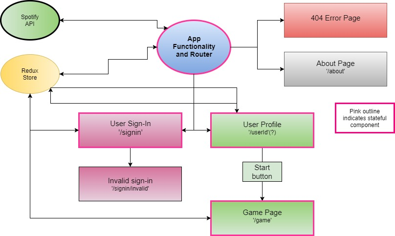

# _On The Spot-ify_

#### By: _**Kayl Eubanks**_

### Useful links to refer to during development
* Blog on making an API call in Postman with the Spotify API - http://blog.getpostman.com/2016/11/09/generate-spotify-playlists-using-a-postman-collection/
* Spotify Developer documentation - https://developer.spotify.com/
* Create React App - https://github.com/facebook/create-react-app.git
* add CORS extension to browser
* Spotify API example libraries - https://developer.spotify.com/documentation/web-api/libraries/

## Description

_This app is a music quiz using the Spotify API and user data to create a personalized experience. This application is built with React via the create-react-app._

### Project Proposal:
* Name of Project: _On The Spot-ify_

* Project’s Purpose or Goal: _This app will allow users to play a personalized music quiz using their own Spotify API data. Eventually will turn into a two-player competitive quiz using artists/songs known to both players._

* List the absolute minimum features the project requires to meet this purpose or goal:
 * _Will use my personal Spotify account for verification_
 * _Will play short clip of song and provide 4 choices of potential answers to player_
 * _Will give points to player if song is identified correctly, point value varies based on time taken to answer question_
 * _Will track overall point total and average time to answer for a play session_

* What tools, frameworks, libraries, APIs, modules and/or other resources (whatever is specific to your track, and yourlanguage) will you use to create this MVP? List them all here. Be specific.

 * React
 * Spotify API
 *  Redux
 *  Create React App
 *  Firebase or custom Heroku SQL database

* If you finish developing the minimum viable product (MVP) with time to spare, what will you work on next?

 * _Allow input of different user authentication and return more personalized quiz data_
 * _Connect two instances of app for competitive play_
 * _Compare two separate users and return commonly shared artists/songs/albums etc._

* What additional tools, frameworks, libraries, APIs, or other resources will these additional features require?

 * socket.io (?)
 * need more research on connecting two instances of app through internet

### Project Log:
* 7/13/18:
  * Spend morning (8:30am-12pm) attempting to make a successful api call via Postman
   * Unsuccessful. Trouble with authentication and submitting request correctly
   * Speak with Tyler about this if unable to resolve by 7/18/18
  * Created initial project folder and repo on GitHub, gather dependencies and dev tools (1pm-2pm)
   * Recalled Tyler suggesting using Create React App. Decided to scrap and start from scratch
  * Recreate project folder using Create React App
  * Editing README to include Project Proposal and Project Log sections
  * Spend rest of day planning project and reading documentation for Spotify API and Create React App functionality`

* 7/17/18:
  * Make successful API call in Postman and identified the 30 second preview URL

## Setup/Installation Requirement for Developers:

* Clone repository on your local computer from https://github.com/K-Banks/On-The-Spotify.
* Navigate into project directory in command line.
* Install node package manager if not already installed on local machine.
* Run '$ npm install' to download all needed dependencies.
* Run '$ npm run start' to serve the app on localhost:8080.

## Component Tree

## Known Issues
_No known bugs at this time._
_Please contact author at kayleubanks@gmail.com with any bugs._

## Technologies Used

 * JavaScript
 * React
 * JSX
 * This project was bootstrapped with [Create React App](https://github.com/facebookincubator/create-react-app).

### License

This software is licensed under the MIT license.

Copyright (c) 2018 ****_Kayl Eubanks_****
